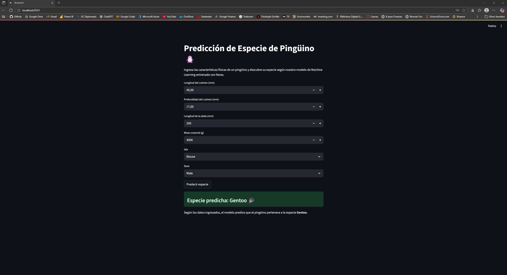

# 🐧 Clasificador de Especies de Pingüinos

Este proyecto utiliza técnicas de aprendizaje automático para clasificar especies de pingüinos usando el dataset **Palmer Penguins**. El modelo se entrenó con **Keras** y se desplegó en una aplicación interactiva con **Streamlit**, permitiendo predecir la especie de un pingüino en base a sus características físicas.

---

## 📄 Descripción

El proyecto fue desarrollado como parte de la **Evaluación Práctica 2** del curso de Plataformas para Machine Learning (Diplomado en ML UC). Se estructura en dos partes principales:

- 📁 **`parte0/`**: Entrenamiento del modelo.  
  - Se preprocesan los datos, se escalan las variables y se entrena una red neuronal usando TensorFlow/Keras.
  - Se guardan los artefactos resultantes: `modelo_penguins.keras`, `scaler_penguins.joblib`, `train.csv` y `test.csv`.

- 📁 **`app/`**: Aplicación Streamlit.  
  - Carga el modelo y permite al usuario ingresar características de pingüinos o seleccionar un registro del dataset para predecir su especie.
  - Incluye despliegue opcional con Docker.

---

## 📸 Captura de la aplicación



## ⚙️ Tecnologías utilizadas

- `Python`: lenguaje base del proyecto  
- `TensorFlow` / `Keras`: entrenamiento del modelo  
- `Streamlit`: interfaz web para predicción interactiva  
- `Pandas` / `Seaborn`: análisis y visualización de datos  
- `Scikit-learn`: preprocesamiento y validación  
- `Matplotlib`: visualización del entrenamiento  
- `Joblib`: serialización del escalador  
- `Poetry`: gestión de dependencias y entornos virtuales  
- `Docker`: contenedorización de la app

---

## 🔧 Ajustes realizados

- Se eliminaron referencias innecesarias a `streamlit` en la carpeta `parte0/`.
- Se reemplazaron varias dependencias con `"*"` por **números de versión específicos** en `pyproject.toml` para evitar conflictos durante la instalación, especialmente entre `tensorflow`, `keras`, `scikit-learn` y `streamlit`.

---

## 🧪 Ejecución local

### 1. Clonar el repositorio

```bash
git clone https://github.com/tu_usuario/Evaluacion-pinguinos.git
cd Evaluacion-pinguinos


